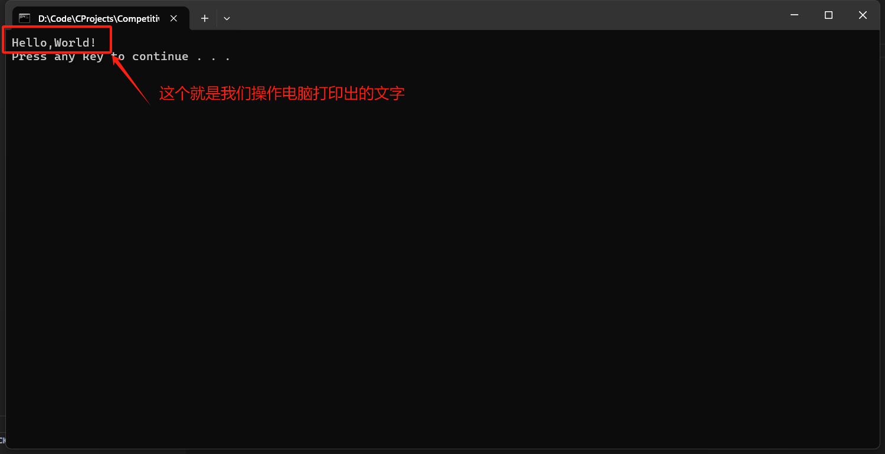
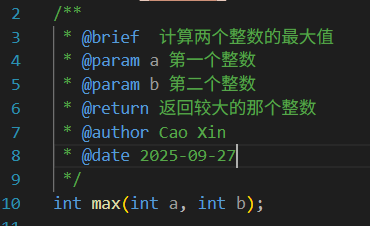

# Debug 2025 Freshman - C Programing

## Chapter02 - IO and Flow Control

本章将正式开始学习 C 语言相关的内容。

### Hello, World!

在正式入门语法之前，我们需要明白什么是**输入**与**输出**。

对于人类而言，眼睛、耳朵、鼻子能够帮我们从外界获取视觉、声音、气味信息，这些器官就是我们人体的**输入设备**。

而嘴能说话、手能写字，这些器官能将我们脑中的想法传达给外界，就是我们人体的**输出设备**。

同样的电脑的键盘、鼠标、麦克风就是电脑的**输入设备**，而显示器、扬声器就是电脑的**输出设备**。

形式化的，对于一个系统而言，输入设备帮助系统从外界获取信息，输出设备帮助系统向外界发送信息。

就像我们的大脑能进行思考与运算、能记忆知识，小脑能控制我们身体的运动，除了输入输出设备之外电脑也有相应的**运算器**、**存储器**、**控制器**，也就是 CPU 和 硬盘。

而我们写**程序**，本质上就是在**控制计算机按照人类的逻辑去执行任务**，也就是从输入设备获取信息，控制电脑对信息进行处理运算，最后将信息给到输出设备。

就像人类从出生开始就要学习如何说话一样，写程序的第一步也是控制电脑进行一个最简单的输出。

对于人类而言，最直接的输出方式必然是说话，同样的，对于电脑而言最直接的输出方式是**打字**。

打开你的 IDE（Dev-C++），新建一个文件并写入下面的代码，然后运行：

```c++
#include <stdio.h>

int main () {
    printf("Hello,World!");
    return 0;
}
```

然后你就会看到类似下面的窗口：



这句`Hello, World!`就是我们操作电脑在窗口中打印出的文字，而上面这个程序就是你的**第一个 C 语言程序**，同样也是你**控制电脑进行输出**的第一个成功尝试。

我们将现在这个黑色的窗口称为**控制台**，是我们目前控制电脑输出以及电脑获取输入的主要平台，在接下来的 C 语言课程中将会经常用到。

现在让我们回到这段代码，看看这段代码都干了什么：

```c++
// 引入输入输出库
#include <stdio.h>

// 主函数
int main () {
    // 在控制台打印 Hello, World!
    printf("Hello,World!");
    // 主函数默认返回 0
    return 0;
}
```

相信你除了打印 `Hello, World!`以外都看得一头雾水。但是没有关系，我们接下来的课程将会一一介绍。

在这里，你只需要知道两点：

首先对于这句代码

```c++
#include <stdio.h>
```

`<stdio.h>` 是 C 语言的**标准输入输出库**，其中`stdio`是`standard input/output`的缩写，`.h`表示这是一个 C 语言的**头文件**。

你可以将`stdio.h`理解为一个工具箱。

就像我们用螺丝刀拧螺丝，用电烙铁焊接电路，不同的任务需要不同的工具控制。而我们用来控制输入输出的工具，例如我们用来打印文字的`printf()`工具，就在 `stdio.h `里面放着。

同样的，头文件的类型还有很多，例如 `<math.h>` 就能用来执行各种数学运算，`<time.h>` 可以用来或许时间。

我们叫这样的一些 C 语言自带的工具箱的集合叫做 **C 语言标准库**，这其中包含着很多前辈们帮我们开发好的工具，我们只需要使用 `#include` 引入这些工具，就能很方便地使用他们。

你可以在 [C 标准库 | 菜鸟教程](https://www.runoob.com/cprogramming/c-standard-library.html) 获取到 C 语言标准库的更多详细信息。

其次，对于剩下的这部分代码

```c++
int main() {
	// 代码从这里开始运行
	/**
	 *
	 *
	 *
	 */
    // 运行到这行之后程序退出
    return 0;
}
```

则定义了程序的入口。简单来说，代码会从 `int main() { ` 的下一行**开始执行**，运行到 `return 0;`之后**结束执行**。

其中 `int main();` 被称为**主函数**，至于什么是**函数**，我们将会在后面的章节中介绍。

总观整份代码，你会发现诸如 `int `、`return` 之类的用空格分隔开的不同单词，在 C 语言中我们称之为**关键字**，电脑就是通过解析这一个个的关键字，以及他们之间的关系，也就是**词法分析**与**语法分析**，解读我们书写的代码的。

若干关键字组成一条**语句**，每条**语句以 `;` 结尾**，通过若干条语句组成一个 C 语言程序。

在这之后你可以打印任意的文字了，让我们简单地做一个实验，分别在主函数中运行下面两份代码：

```c++
printf("Print end of line: next line");
printf("Print end of line: /n next line");
```

你会发现第一行代码输出的是：

```
Print end of line: next line
```

而第二行代码输出的是：

```
Print end of line: 
next line
```

这两行代码的区别就在于加入了一个 `/n` 字符，用来表示换行。

是的，实际上换行也是一个字符，只不过它的显示方式和普通的字符有些不同罢了。

形如 `/n` 这样的字符在 C 语言中被称为**转义字符**，你可以在 [转义序列 | Microsoft Learn](https://learn.microsoft.com/zh-cn/cpp/c-language/escape-sequences?view=msvc-170) 学习更多有关转义字符的类型。

建议你在打印一串字符之后，都在字符的末尾加上 `/n` ，这样能让你更好地在控制台中区分不同的输出。

### Data Type

现在我们知道了可以使用 `printf()` 在控制台中打印一串文字，同样的我们可以打印其他的除了文字之外的东西。

尽管文字是我们日常生活中最为常见的数据类型，但是计算机实际上更擅长处理的是数字而非文字。

根据要处理数据的不同类型，C 语言将这些数据分为了整数、小数、字符等等类型：

```c++
// 定义一个名称为 number 的整数变量，值为 1
int number = 1;
// 定义一个名称为 pi 的小数变量，值为 3.14
float pi = 3.14;
// 定义一个名称为 ch 的字符型变量，值为 'A'
// 注意这里需要打单引号 ' ', 引号中间只能放一个字符
char ch = 'a';
```

值得一提的是，在 C 语言中小数有一个更加常用的叫法：浮点数。顾名思义，就是小数点会浮动的数字，相比之下整数则是没有小数点的。

其中，`int` 是 `integer` 的简写，`char` 是 `character` 的缩写，而 `float` 其实是 `float point` 也就是浮点的简写。

结合上面我们学习的 `printf` 语句，就可以将这些数据的值打印出来：

```c++
char ch = 'a';
// 打印 number，其中 %d 表示数据类型为整型
int number = 1;
printf("number = %d/n", number);
// C 语言会自动按照逗号后面的量的出现顺寻在前面的 %d 处填入数值
int a = 1, b = 2, c = 3;
printf("a = %d, b = %d, c = %d/n", a, b, c);
// 打印 pi， %f 表示数据类型为浮点型
float pi = 3.1415926;
printf("pi = %f/n", number);
// 打印 ch， %.2f 表示数据类型为字符型，四舍五入到两位小数
printf("pi = %.2f/n", number);
// 打印 ch， %c 表示数据类型为字符型
printf("ch = %c/n", ch);
```

运行代码之后可以得到这样的结果：

```bash
number = 1
a = 1, b = 2, c = 3
pi = 0.000000
ch = a
```

这时候我们就可以解释 `printf()` 的行为了：`printf` 是 `print format` 的缩写，意思是按照**格式打印文字**。而按照什么格式以及打印什么样的数据，则由 `printf("str", ...)`，的这个 `"str"` 中的内容确定。

同样我们可以对这些数据进行运算：

```c++
int a = 2;
int b = 3;
int add = a + b;
int mul = a * b;
int div = b / a; 
int ext = (a + b) * (a * b);
printf("a = %d, b = %d, add = %d, mul = %d, div = %d, ext = %d", a, b, add, mul, div, ext);
```

得到这样的输出：

```bash
a = 2, b = 3, add = 5, mul = 6, div = 1, ext = 30
```

可以发现，`div` 的值与我们预期的不一样，这是因为我们输出的是一个**整数**，而实际上期望的 `1.5` 是一个**浮点值**，浮点值在转换到整数的时候，会自动舍去小数点后的部分，也就是**向下取整**，这一行为我们称之为**舍入误差**。

关于 C 语言整数与整数，小数与整数，小数与小数之间运算的规则十分复杂，我们只需要记住两件事：

第一，整数相除发生的是整除。第二，在一个表达式中尽量只使用一种数据类型。牢记这两点就能帮助你规避掉开发当中会遇到的大部分问题（但是不能保证你通过考试的刁难）。

这样看来只有这些整型、浮点型、字符型三种数据类型吗？当然不是。我们要知道的是，计算机对数据的表示能力是有限的，也就是说像 `int` 这样的整数类型是有长度上限的。

我们可以做一个简单的实验：

```c++
// 定义一个值为 10^9 (10 的 9 次方) 的变量 a
// 补充：1e9 是科学计数法的表示，类似的还有 1e-2 表示 0.02 之类的
int a = 1e9;
// 定义一个值为 10^9 (10 的 9 次方) 的变量 a 
int b = 1e9;
int mul = a * b;
printf("mul = %d", mul);
```

得到的结果居然是

```
mul = -1486618624
```

这根本不对！

答案就是，`a * b` 的值超过了 `int`  类型的表示范围，因此结果就变为一个预期之外的值，这一现象我们称之为**溢出**，在这里发生的就是**整型溢出**。

虽然这个值可以通过某个规则计算出来，但是我们这里不做要求，因为实际开发中根本不会利用这种特性。

在 C 语言中，还提供了其他的一些数据类型，以支持更大的数字以及更高的运算精度。例如：

```c++
long long a = 1e9;
long long b = 1e9;
long long mul = a * b;
printf("mul = %lld", mul);
```

就能得到正确的结果

```bash
mul = 1000000000000000000
```

更多的数据类型可以查看：[C 数据类型 | 菜鸟教程](https://www.runoob.com/cprogramming/c-data-types.html)

在这张表中可以看到，`int` 类型的长度是 **4 个字节**（一般情况下），一个字节有 8 个二进制位，那么 `int` 类型就能表示 $2^{4*8} = 2^{32}$ 个数，这 $2^{32}$ 个数字会被对半分到正负半轴。

### Input and Output

除了 `printf()` 之外，C 语言还提供了 `putchar()` 进行单个字符的输出：

```c++
char ch = 'a';
putchar(ch);
```

可以运行得到下面的输出：

```
a
```

前面我们已经学习了如何在控制台进行输出，但是我们还不知道如何在控制台进行输入。

方法与输出是类似的：

```c++
int n;
// 输入整型变量 n 的值
// 注意变量之前需要带上 & 
scanf("%d", &n);
```

同样的 `scanf()` 是 `scan format` 的缩写，意思是从控制台按照给定格式扫描并拿到输入的字符。例如：

```c++
int a, b, c, d;
printf("input 4 number (separate by spaces): ");
// 输入四个数字，以空格分隔,（默认）以换行符结尾
scanf("%d %d %d %d", &a, &b, &c, &d);
printf("a = %d, b = %d, c = %d, d = %d", a, b, c, d);
```

运行程序之后，控制台会等待你的输入，直到输入的数据足够。

**Input**:

```
input 4 number (separate by spaces): 1 2 3 4
```

**Output**:

```bash
a = 1, b = 2, c = 3, d = 4
```

`scanf()`的行为实际上较为复杂，你可以简单理解为 `scanf` 在输入的时候会默认地丢弃所有空字符（包括空格、换行、制表符），只输入有实际意义的数据

如果我们想要输入被 `scanf()` 丢弃的空字符，例如输入空格或者换行符之类的，就需要用到 `getchar()`：

```c++
char ch;
ch = getchar();
putchar(ch);
```

Input:

```
a
```

Output:

```
a
```

到这里你应该会发现，`scanf()` 的行为和 `getchar()` 不完全一样，因此为了避免这种分析与调试上的麻烦，一般不建议将 `scanf()` 与  `getchar()` 混用，以避免发生一些意料之外的程序行为。

### Comments

注释是开发过程中极为重要的一部分，有句话说的好：写代码不写注释，连一个月后的自己都看不懂。在完成程序的同时，对一些关键点标记注释是极为重要的。

注释是代码的自然语言标注，不会被识别为真正的代码的一部分，但是却可以帮助你的同伴，也就是人类程序员更好地理解代码，并在你的代码上作出修改。

#### Inline Comments

第一种注释是**行内注释**，这种注释在前面的代码中也出现过：

```c++
// 这是行内注释
int n; // 这也是行内注释
```

行内注释会将 `//` 后面的文字全部标记为注释，一般而言行内注释遵循几点规范：

第一，行内注释**单独提行**，不要标注在代码的末尾

```c++
// （建议）这是一个好的注释
printf("QwQ"); // （不建议）这是一个不好的注释
```

第二，行内注释的 `//` 后面需要**紧跟空格**：

```c++
// 这是一个好的注释（建议）
//这是一个不好的注释（不建议）
```

第三，行内注释一般用于注释代码的**中间过程**，也就是代码实现部分。

```c++
// （不建议）这是一个不好的行内注释，因为这个注释用来注释主函数，而不是逻辑
int main() {
    int n;
    // (建议) 这是一个好的行内注释，因为这个注释用来注释了代码的逻辑实现
    scanf("%d", &n);
}
```

这几点能让你的注释风格更为工整规范，便于阅读。

#### Block Comments

第二种注释是**块注释**，顾名思义就是成块的注释：

```c++
/**
 * 主函数
 * 程序的入口
 */
int main() {
```

其中，`/*` 标志着块注释的起始，`*/` 标志着快注释的结尾。这两标志之间闭合的一个区域全部会被标记为注释。

一般而言，块注释也遵循几点规范：

第一，块注释**单独提行**：

```c++
/**
 * （建议）这是一个好的块注释
 */
int main() {
    int n; /*
    （不建议）这是一个不好的注释
    */scanf("%d", &n);
}
```

第二，**每一行**块注释的**起始位置**需要打上`*`，块注释的**第一行**需要打**两个** `*`，且一般**不写内容**，最长的那一列`*`一般对齐：

```c++
/**
 * （建议）这是一个好的注释
 */

/**

（不建议）这是一个不好的注释，因为每行的开头没有打上 * 号，导致块注释的起始和结尾不够明确

 */
```

第三，块注释的 `*` 号和文字之间需要**打印空格**：

```c++
/**
 *这是一个不好的注释，因为第一个文字和符合之间没有空格（不建议）
 */
```

第四，块注释一般用于注释函数或者文档

```c++
/**
 * （建议）这是一个好的块注释，因为它被用来注释主函数
 */
int main() {
	int n;
    /**
     * （不建议）这不是一个好的块注释，因为它被用来注释中间过程
     */
    scanf("%d", &n);
}
```

块注释的特点是占用代码行数多，足够醒目，因此常常用来标记代码中较为重要的部分，而类似中间过程这样的次要部分使用块注释就显得有些打乱代码逻辑了。

遵循上面的这几点也能帮助你的代码变得更加工整规范。

#### Doxygen Style Comments

Doxygen 风格的**文档注释**能够帮助你在块注释中给注释信息添加额外的内容：

```c++
/**
 * @brief 计算两个整数的最大值
 * @param a 第一个整数
 * @param b 第二个整数
 * @return 返回较大的那个整数
 * @author Cao Xin
 */
int max(int a, int b);
```

在大部分的现代化 IDE （例如 VS Code）中，使用 Doxygen 风格的文档注注释能使得块注释更为清晰：



详细的 Doxygen 风格的文档注释介绍在这里：[Doxygen 注释规范（C语言版）| Doxygen_stu ](https://viys.github.io/doxygen_stu/index.html)

拓展阅读：[Doxygen - 治好了我的代码注释强迫症 | 知乎](https://zhuanlan.zhihu.com/p/314971283)

总而言之，注释风格的第一要义就是工整，写多了工程之后你就会明白，一份有着工整注释以及标准代码风格的的代码是多么的赏心悦目。

### Flow Control

你已经学会了 C 语言中基本的语句与运算的使用了，但是你肯定不会满足：不是说写代码就是控制电脑干活吗？直接在主函数中按顺序执行代码似乎也不能实现所有的逻辑吧？

没错，但是在此之前让我们先回到一个经典问题：把大象放进冰箱需要几步？

你会说：打开冰箱，放进大象，关上冰箱。这就是**顺序结构**，也就是将任务按照顺序执行：

```
[打开冰箱] -> [放进大象] -> [关上冰箱]
```

但是显然的，大象并不能放进冰箱。

更形式化的，把一个东西放进冰箱要分几步？当然是：打开冰箱，判断是否可以放入并执行，关门。

这就是一个**分支结构**，即为经过判断之后选择执行的任务。

```
   [打开冰箱]
       |
  [能放下吗?]
   /       /
 [是]     [否]
   |        |
[放进去]  [无法放]
   /       /
   [关上冰箱]
```

同样的，如果我们有很多东西要放进冰箱，我们就需要不断的重复上面的过程：开门，判断是否放入并执行，关门。

这样不停的重复执行一系列任务的流程，我们称之为**循环结构**。

```
[打开冰箱] 
      |
[还有东西?] -否-> [结束]
      |
     是
      |
[放入物品] -> [关上冰箱] -> 回到 [打开冰箱]
```

### if and else

就像做判断题只有真假二值，C 语言中的判断语句也只有真假二值。

对于这样的只有真或者假的值，我们称之为**布尔值**（Boolean），因为这是一个叫 Bool 的科学家发明的。

在 C 语言中，我们可以通过引入头文件 `<stdbool.h>` 的方式在代码中使用布尔值：

```c++ 
#include <stdbool.h>
#include <stdio.h>

int main() {
    // 定义一个变量 ok, 值为假（false）
	bool ok = false;
	printf("false = %d/n", ok);
    // 修改变量 ok 值为真（true）
 	ok = true;
    printf("true = %d/n", ok);
}
```

运行得到的结果如下：

```
false = 0
true = 1
```

可以发现，实际上布尔值的 `true` 和 `false` 实际上在 C 语言中就对应着 `0` 和 `1`。

在 C 语言中，我们定义：不等于 0 的值为真

有了布尔值，那么相对应的我们就有操作布尔值的**布尔运算符**，运算结果为布尔值的**布尔表达式**。

```c++
int a = 0, b = 2;
// 判断 a > b
printf("a > b = %d/n", a > b);
// 判断 a < b
printf("a < b = %d/n", a < b);
// 判断 a 是否与 0 相等
printf("a == a = %d/n", a == 0);
// 判断 a 是否不与 0 相等
printf("a == a = %d/n", a != 0);
// 判断 b 是否大于等于 0
printf("b >= 0 = %d/n", b >= 0);
// 判断 a 是否小于等于 0
printf("a <= 0 = %d/n", a <= 0);
```

得到的结果为：
```bash
a > b = 0
a < b = 1
a == a = 1
a == a = 0
b >= 0 = 1
a <= 0 = 1
```

在 C 语言中，为了区分赋值 `a = 0` 和判断 `a == 0`，判断 `==` 需要写两个等号。

在 C 语言中实现分支结构需要用到 `if` 以及 `else` 两个关键字，他们的用法也很直观：

```c++
int a, b;
scanf("%d %d", &a, &b);
    
// 如果 a 等于 b 就打印 "a == b"
if (a == b) {
	printf("a == b/n");
}

// 如果 a 大于等于 b 就打印 "a >= b"，否则打印 "a < b"
if (a >= b) {
	printf("a >= b/n");
} else {
    printf("a < b/n");
}

if (a == b) {
    // 如果 a 等于 b 就打印 "a == b"
	printf("a == b/n");
} else if (a > b) {
    // 否则就判断 a 是否大于 b，如果是，打印 "a > b"
    printf("a > b/n");
} else {
    // 否则打印 "a < b"
    printf("a < b/n");
}
```

这就是 C 语言中 `if`、`if - else`、`if - eles if - else` 语句的用法。

