# Debug 2025 Freshmen - C Programing

## Lab01 - Intro

Debug 实验室 2025 新生集训 C 语言编程课程第一部分：配置开发环境

### Environment Prepare

**重要1：浏览器使用 Edge 、Chrome 、Firefox 之一，没有这三者之一的直接去下载一个 Edge 安装**

**重要2：默认搜索引擎都使用 Bing，有条件的使用 Google，不要用百度、搜狗、360 这种垃圾国产搜索引擎**

**重要3：所有软件和代码都不要放到 C 盘，除非你没得选。桌面上的文件也是存在 C 盘内的，非必要不要在桌面放文件**

**重要4：先把整个章节浏览一遍，大概清楚要做什么再开始配置，不要上来就跟着教程配**

#### 1. Config C/C++ Develop Environment

##### New Folder

这一步我们将完成新建文件夹的操作。

首先，除非你电脑只有一个 C盘，我们在除了 C 盘以外的地方，在**盘的根目录**先新建一个 **Code 文件夹**，用来存放我们的代码。

大概像下面这样：

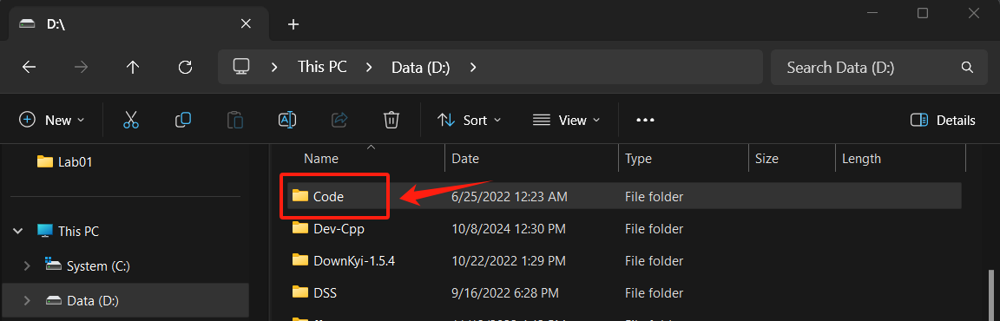

如果你只有一个盘符，也就是你的电脑只有一个 C 盘，那你就在 C 盘的根目录下面新建一个 Code 文件夹。

以后我们**所有的代码**都要放在这个 **Code 文件夹**下，这个操作会帮助你在今后几乎整个开发生涯中避免非常多不必要的麻烦，请你务必落实到位。

##### Install Dev-C++

参考这篇文章配置：[DevC++安装教程（附安装包）DevC++下载详细安装图文教程 - 知乎](https://zhuanlan.zhihu.com/p/1951939681328555818)

需要注意的是：在 **使用DevC++编写C语言程序** 这一章节中，**3) 更加快捷的方式** 小节提到的方法需要牢记，我们以后开发调试都推荐这种方法。

##### Install Oher IDE

稍微研究了 Dev-C++ 之后你就会知道，这是一个及其简陋的开发环境。

这里向你推荐几个更加现代化的IDE（集成开发环境）。

1. [CLion](https://www.jetbrains.com/clion/)，JetBrains 家产品，拥有超高集成度的开发环境以及美观的 UI 界面，能够满足绝大多数开发需求，专业版可以通过 [GitHub Education](https://github.com/education) 免费获得，缺点在于没有专业版的情况下开发局限性较高，并且不开源，社区相对而言没有 VS Code 好，并且不够轻量化，占用系统资源较高。
2. [Visual Studio Code](https://code.visualstudio.com/)，Microsoft 家产品，也叫 VS Code，著名开源项目，基于插件驱动的几乎适配任何开发任务的代码编辑器，其实并不算严格意义上的 IDE。缺点在于 C++ 开发环境配置较为繁琐，不清楚原理的新手可能上手较为困难，优点在于足够轻量化且生态丰富、拓展性强。

#### 2. Regester to OJ Platfrom

刚才你已经成功配置好了 C 语言开发环境。接下来这一步我们要在两个平台注册账号，并配置好做题环境。

首先到 **[Virtual Judge](https://vjudge.net/)** **注册**一个账号，注册的时候设置**昵称**为你的**真实姓名**，并**登录**你的账号。

然后到 **[洛谷](https://www.luogu.com.cn/)** **注册**一个账号，并**登录**你的账号。

点击这个链接加入Virtual Judge 团队： [Debug Freshman 2025](https://vjudge.net/group/debug-freshman?r=ygdmIbkSgOfm8QgPS3KN)。

可能要等管理员同学通过一下。

在 Virtual Judge 通过 **团队/Debug Freshman 2025** 进入团队页面：
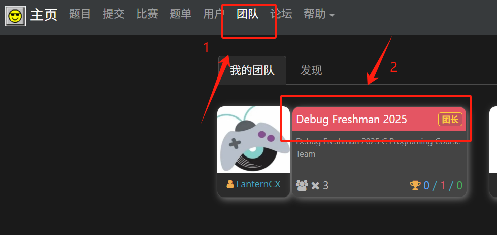

可以看到一个类似这样的界面：

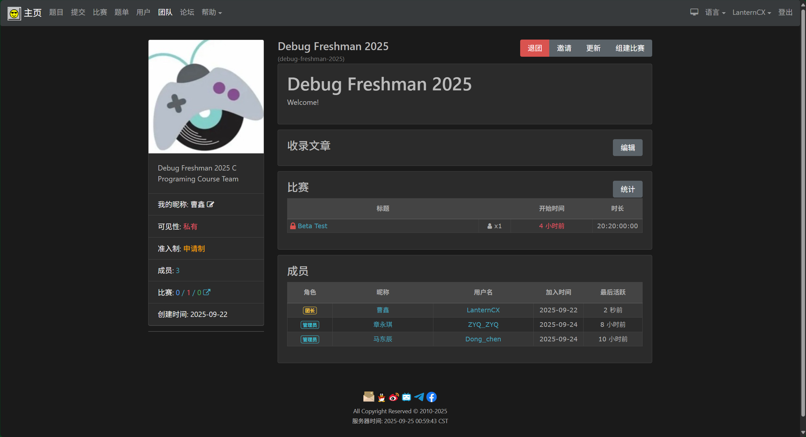

在**比赛**栏，点击进入 **Beta Test**：

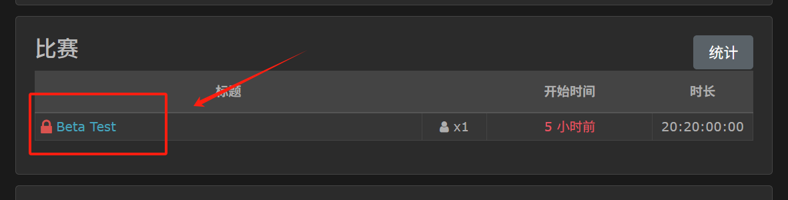

进入 **Hello, World!**：

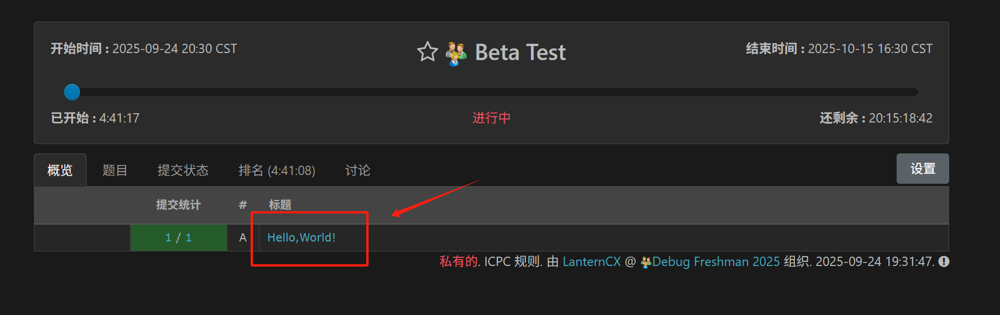

点击**提交**，在**账号**处点击**更新**：

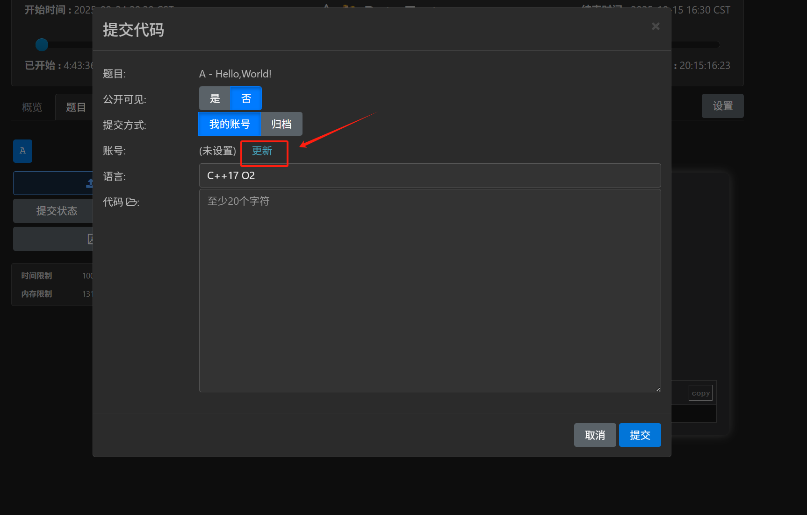

能看到下面这样的页面：

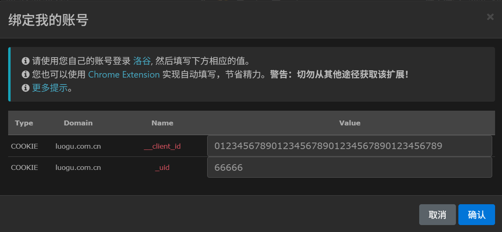

保持这个网页不变，在浏览器内再**新开一个网页**，进入**洛谷**，并确保你已经登录了你的洛谷账号。

按 `Ctrl + Shift + I` 或者 `F12` 或者通过浏览器选项打开浏览器开发者工具，大概能得到这样一个页面：

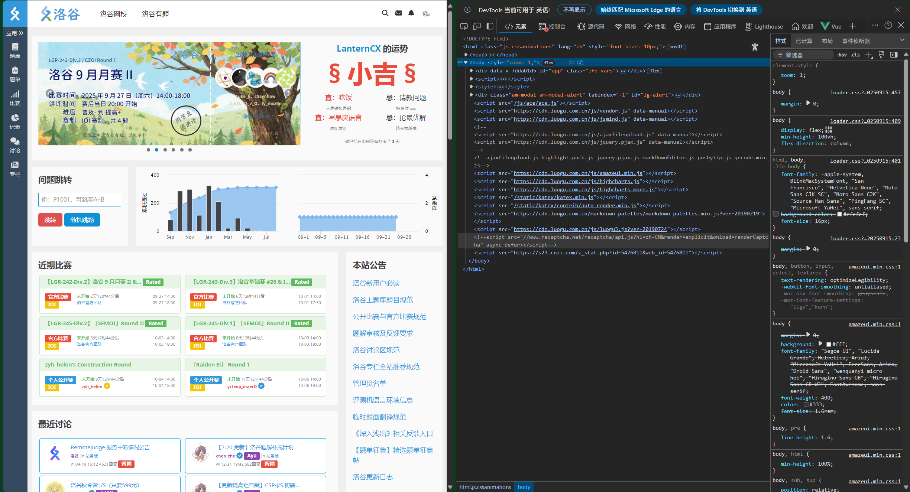

在开发者工具找到**应用程序**或者 **Application**，然后找到 **Cookie**，分别双击 `__client_id` 和 `_uid` 的值并将它们**复制填写**到刚刚在 **Virtual Judge** 打开的**表单**，然后**确认**。

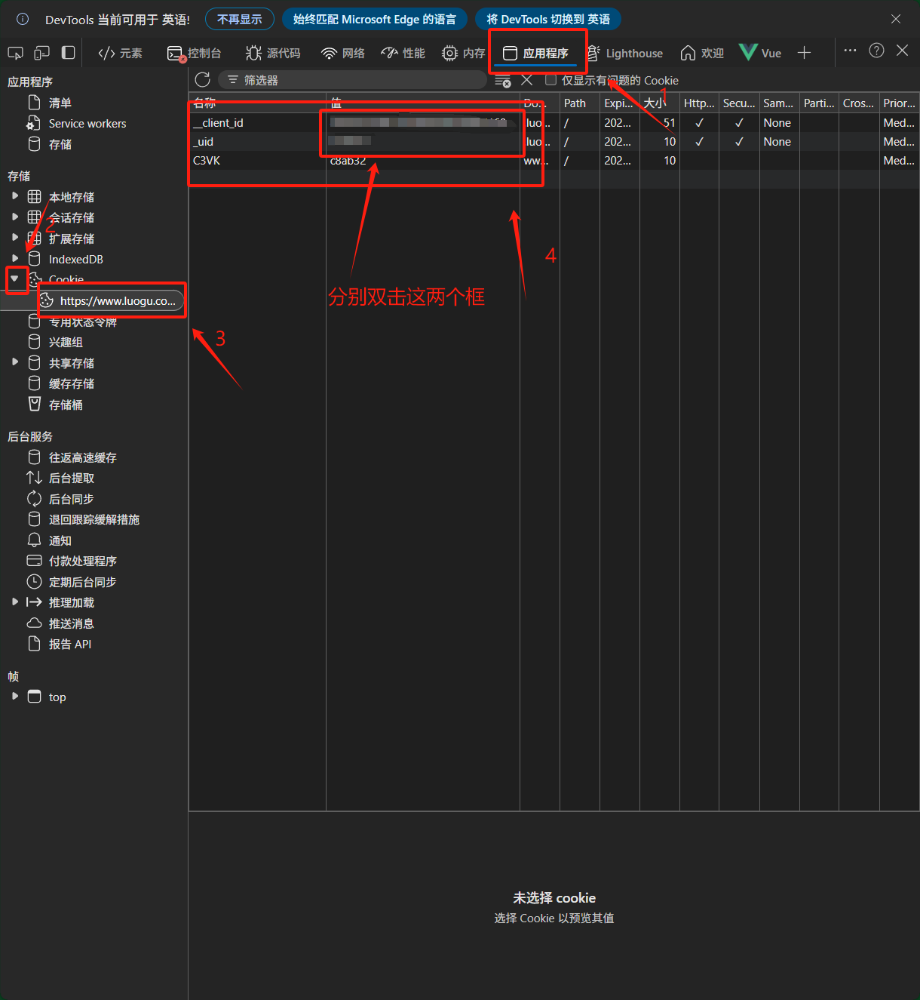

这个地方如果能看到你的**洛谷账号**名称，并且是**绿色打勾**的状态，就没有问题了。

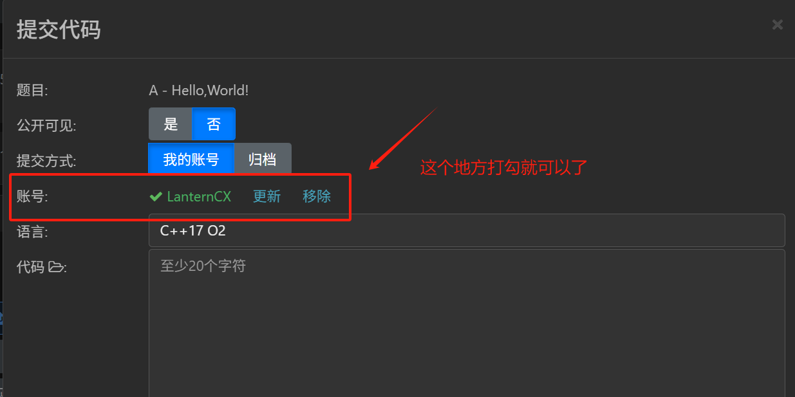

在语言处选择 C++17 O2， 并在代码处填入下面的代码：

```c++
#include <stdio.h>

int main () {
    printf("Hello,World!");
    return 0;
}
```

这时候你的页面应该看起来像这样：

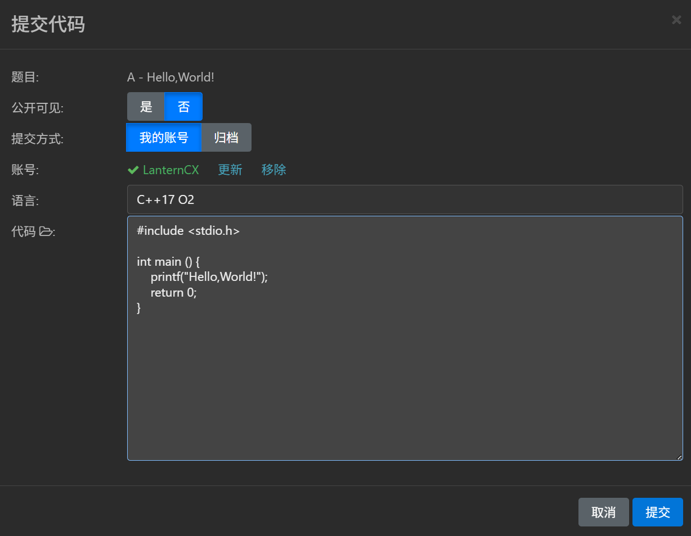

点击提交，如果碰到**验证码**问题，就跟**随着指引填写验证码**就好了，如果验证码**填写失败**就**多试几次**。

如果出现类似下面的页面，就说明线上平台的配置完成了。

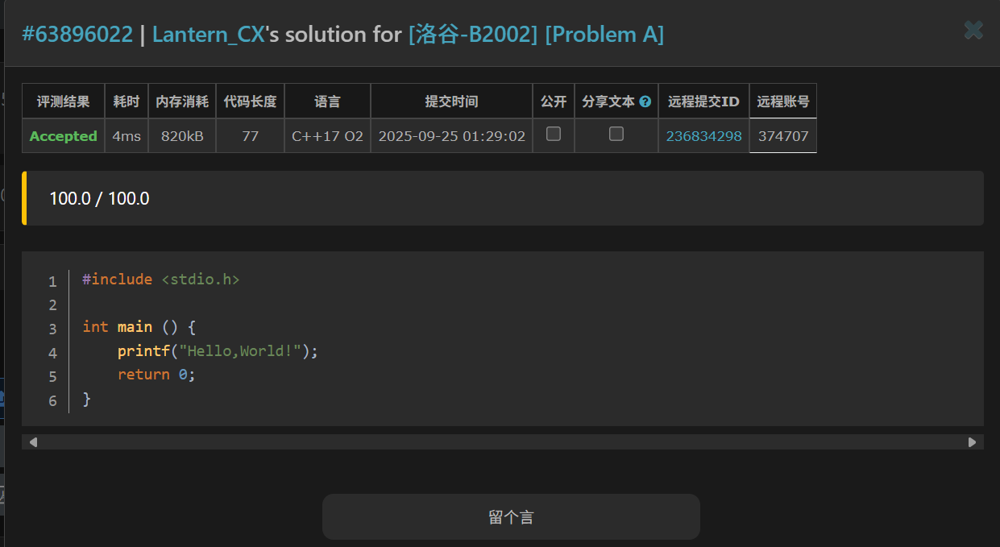

拓展阅读：

[Vjudge 注册与绑定の急速教程 - aminuosi - 博客园](https://www.cnblogs.com/2hard4me/p/18496115)

[Virtual Judge使用指南 - HelloHeBin - 博客园](https://www.cnblogs.com/hellohebin/articles/15200112.html)

注册之后可以先熟悉一下 Virtual Judge 平台，为我们之后的课程作业做准备。有实力的同学也可以提前自学并完成我们发布的课程题集。
